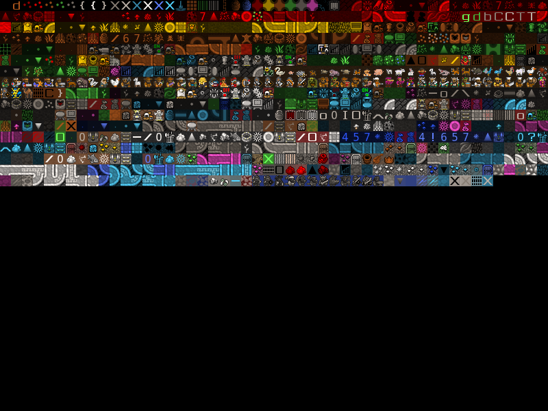

# DFMA Modern Viewer

## A viewer for DFMA (Dwarf Fortress Map Archive) FDF-MAP Files

 Made with P5.js and HTML5 Canvas.

 Visit the [DFMA](https://mkv25.net/dfma)

 Don't have a clue what _Dwarf Fortress_ is?
 In a nutshell, the most complex fantasy world simulation to ever come into existence. Everything from weather patterns, diplomacy, troop movements, economy,  molecular weight, and specific heat capacity to the fact that the dwarf Urist McWeirdo scratches his ear when he is trying to remember something and likes coffins, the color carmine, catapult parts and prefers to consume giant snapping turtle and finger millet beer.
 Find out at more at [Bay12Games.com](https://bay12games.com/dwarves)

> Example:
> 

 ---

### Running Server

The server is an extemrely simple Node.js server
with express framework.

Basically all it does is server static files.

#### Install Dependencies

After cloning repo, install dependencies by running

`npm install`

#### Running Server

Once dependencies are installed, run server by running

`npm start`

Then navigate to _localhost:80_ or simply _localhost_ (since the server is on port 80).

If your machine's firewall allows inbound traffic on port 80, you simply need to connect to the ip address of your local machine in another computer's web browser.

Stop the server by typing <kbd>CTRL</kbd> + <kbd>C</kbd>

---

### Usage

The program will automatically open an FDF-MAP file that
is stored on the server.
Upload your own to view tiles by dragging and dropping the file.

---

### Caveat

The server only supports data file version -1, and -2.
(Normal version and version with tile info).
There is another version which supports RLE encoding, but the file format specification appears to be incomplete.

For now, this parser only supports versions -1, and -2 of the file format. I believe these are the only two formats that the compressor outputs anyway.