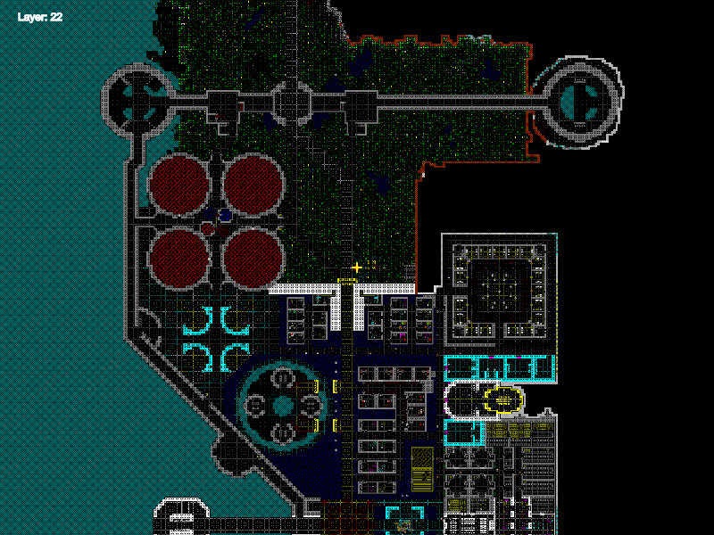

# DFMA Modern Viewer

View it live at [blomquist.xyz/dfma](https://blomquist.xyz/dfma)

## A viewer for DFMA (Dwarf Fortress Map Archive) FDF-MAP Files

 Made with P5.js and HTML5 Canvas.

 Visit the [DFMA](https://mkv25.net/dfma)

 Don't have a clue what _Dwarf Fortress_ is?
 In a nutshell, the most complex fantasy world simulation to ever come into existence. Everything from weather patterns, diplomacy, troop movements, economy,  molecular weight, and specific heat capacity to the fact that the dwarf Urist McWeirdo scratches his ear when he is trying to remember something and likes coffins, the color carmine, catapult parts and prefers to consume giant snapping turtle and finger millet beer.
 Find out at more at [Bay12Games.com](https://bay12games.com/dwarves)

### Example:

### Node.js Module

The 'main.js' file brings together the entire project and packs it into a node module.